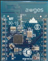

# HomeStark - Rede de sensores 6LoWPAN para IoT</br>


__Desenvolvedor:__ Ânderson Ignacio da Silva
TCC_HomeStark_Ânderson_Ignacio_da_Silva_REV4.pdf
Este projeto é composto de duas partes distintas:
* interface / Interface de controle de sensores via web;
* device_6LoWPAN / Firmware dedicado para os sensores 6LoWPAN que comunicam com
a central;

**Requisitos necessários:**
* Mongo DB - Banco de dados
* Node.js e pacotes
* Uniflash tool para gravar firmware nos nós 6LoWPAN

__device_6LoWPAN:__
</br>
</br>
* **Tipo:** C
* **Arquivo principal:** main_core.c
* **Descrição:** Para executar o projeto deve-se programar os módulos HomeStark com o firmware presente na pasta "device_6LoWPAN", o arquivo do firmware se chama "main_core.srf06-cc26xx", o qual deve ser programado através do **uniflash tool**. Uma vez programado este código o mesmo irá enviar respostas SNMP a interface e exibirá recursos CoAP dos dispositivos no sistema, onde dependo do tipo de dispositivo pode-se alterar. Com ele comunicando 6LoWPAN o usuário poderá na interface trocar os valores dos recursos CoAP a ele definidos.

__interface:__
* **Tipo:**  JavaScript / Node.js
* **Arquivo principal:** server.js
* **Descrição:** Para executar a interface pode-se utilizar a ferramenta "gulp" em node.js que é um automatizador de tarefas e o mesmo irá compilar e executar a aplicação em node.js. Como o sistema roda em node, é necessário executar o comando "sudo npm install" e o comando "bower install" para instalar as dependências de software necessárias. É necessário verificar a porta do servidor web para abrir a interface.

**Obs.:** É necessário conectar o *border router* ou o rádio em SLIP para comunicação tunelada da rede 6LoWPAN com a interface. As duas formas de estabelecer a comunicação tunelada são:
1. Programar um dispositivo com o firmware de border router normalmente localizado no caminho (contiki/examples/ipv6/rpl-border-router), neste caso o *device* irá ser o border router da rede e você só precisa realizar o tunelamento via slip com o comando:
```bash
sudo contiki/tools/tunslip6 aaaa::1/64 -s /dev/ttyACMx
```
Neste modo a criação da rede RPL-DAG-ROOT será feita pelo próprio dispositivo.

2. Compilar o *native-border-router* normalmente localizado em (contiki/examples/ipv6/native-border-router) e rodar no próprio host, neste caso o *device* irá rodar somente o firmware *slip-radio* (contiki/examples/ipv6/slip-radio), o qual irá sniffar os pacotes 6LoWPAN e a conexão tunelada poderá ser aberta através do seguinte comando:
```bash
sudo contiki/examples/ipv6/native-border-router/border-router.native -L -v6 aaaa::1/64 -s /dev/ttyACMx -B 115200 -t tun0
```
Neste modo a criação da rede RPL-DAG-ROOT será feita pelo host.

Obs. 2: Informações adicionais podem ser consultadas no arquivo de pdf *TCC_HomeStark_Ânderson_Ignacio_da_Silva_REV4.pdf*.
